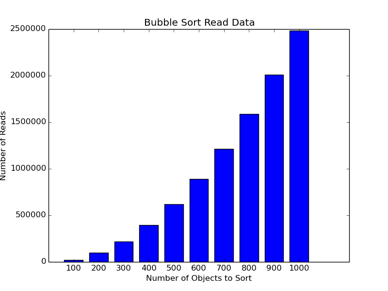
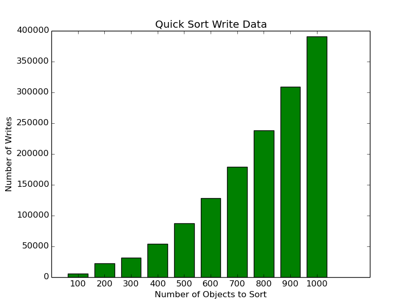

#Module 2 Applied Project: Randomization
###Authored by: Gabe Atkins, Matt Thomas and Josh Winter
##Description:

##Results:

###Bubble Sort Write Times Graph:

###Number of Bubble Sort Reads Graph:

###Heap Sort Read Times Graph:

###Heap Sort Write Times Graph:

###Insertion Sort Read Times Graph:

###Insertion Sort Write Times Graph:

###Merge Sort Read Times Graph:

###Merge Sort Write Times Graph:

###Quick Sort Read Times Graph:

###Quick Sort Write Times Graph

###Selection Sort Read Times Graph:

###Selection Sort Write Times Graph:

