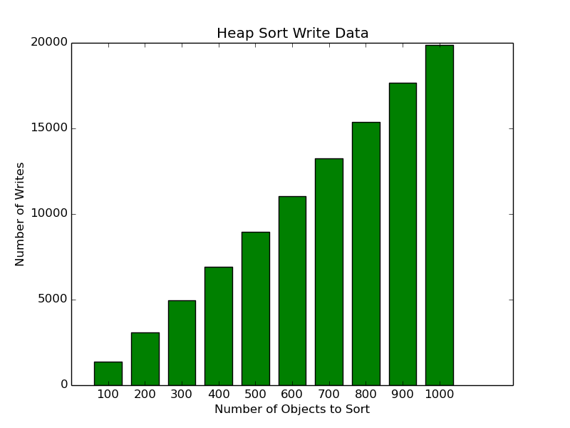
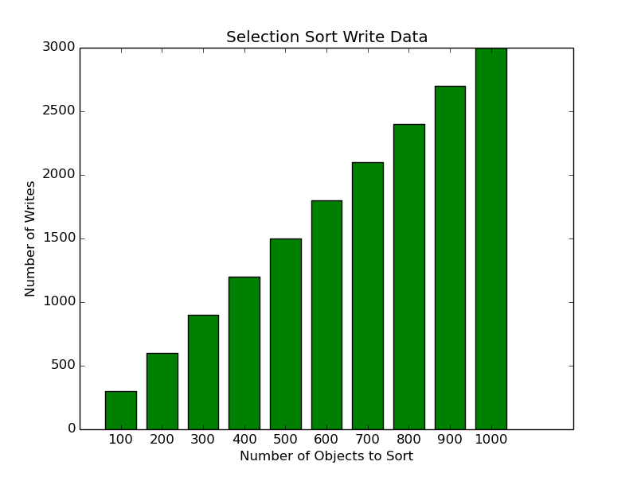

#Module 2 Applied Project: Randomization
###Authored by: Gabe Atkins, Matt Thomas and Josh Winter
##Description:
This program uses the sorting project from Cs-124. This project records the read and write times of 6 different sorting methods. The six different sorting methods uses are bubble
sort, heap sort, insertion sort, merge sort, selection sort and quick sort. Using the CS-124 project as our basis, we have modified it so that after the read and write times are
stored C++ use Command Line Interface (CLI) to run a python script using the store value from our C++ files. Python outputs this data as bar graphs that represent the number of 
read and writes each sorting algorithm had and how long it took to reach that number. Write graphs have green bars and read graphs have blue bars. Python stores these graphs in
the images folder. The graphs have either the number of reads or writes on the Y-axis and the number of objects sorted on the X-axis. To tell if a sorting method is affective at
reading or write in relation to the size of what is being sort simply look at the graph, the higher the number of reads or writes for objects to store means the sorting method is
not efficient. This also makes it easy to tell if a method is better at reading or writing.
##Results:
First to comparing the two graphs we determine the following:
Bubble sort is more efficient at writing.
Heap sort is more efficient at reading.
Insertion sort is more efficient at writing.
Merge sort is equally efficient at both reading and writing.
Quick sort is more efficient at writing.
and finally, selection sort is more efficient at writing.
Bubble sort is by far the worst method, having by far the highest time for both reading and writing. Merge sort is overall the best method because of its tied outputs. The lowest
write time was selection sort by far and the lowest read time was heap sort.
###Bubble Sort Write Graph:

###Bubble Sort Read Graph:

###Heap Sort Read Graph:

###Heap Sort Write Graph:

###Insertion Sort Read Graph:

###Insertion Sort Write Graph:

###Merge Sort Read Graph:

###Merge Sort Write Graph:

###Quick Sort Read Graph:

###Quick Sort Write Graph

###Selection Sort Read Graph:

###Selection Sort Write Graph:

